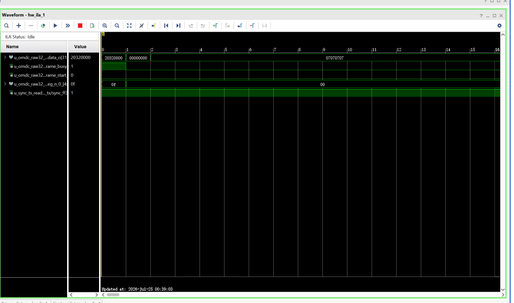
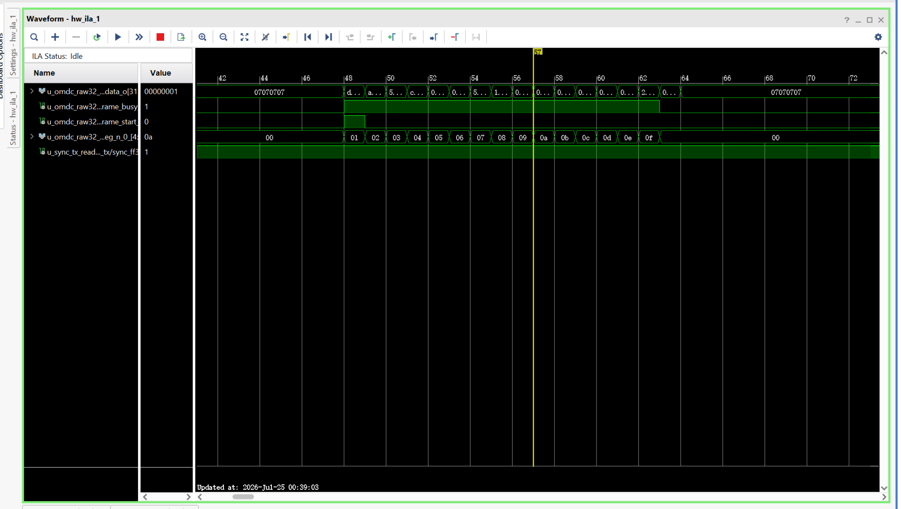
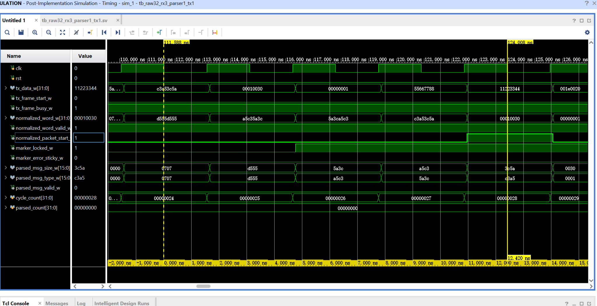
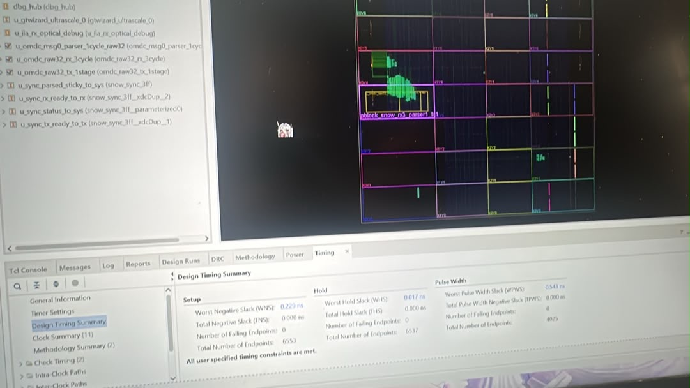
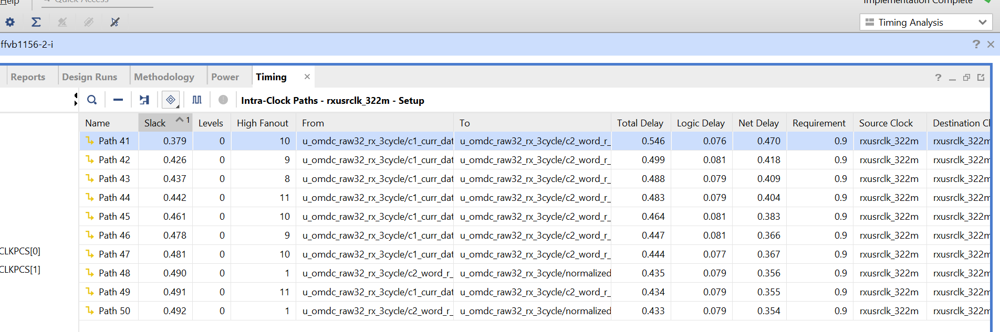

# SnowSakura-FPGA

> **PROJECT STATUS — COMPLETED AND FROZEN**  
> Final public update: **2026-07-25**

SnowSakura-FPGA is an independent physical-layer FPGA engineering record built on a Puzhi ZU15EG. It closes a real 10.3125 Gb/s optical laboratory path from fabric-owned TX data through GTH/SFP/OM4 reception, bounded Raw32 alignment, registered HKEX OMD-C parsing, order-state updates, price-level aggregation, top-of-book selection, and registered snapshot export.

The public project is complete. Its implementation baseline and evidence are frozen; there will be no further routine public development updates. The repository remains online as a technical record and as an entry point for serious private bitstream or protocol collaboration.

## Final result at a glance

| Item | Final public result |
|---|---|
| Device | Xilinx Zynq UltraScale+ `XCZU15EG-FFVB1156-2-I` |
| Serial link | 10.3125 Gb/s, 10G-SR optics over OM4 |
| Proven direction | `GTHE4_CHANNEL_X0Y6 / SFP2 TX` → optics/OM4 → `SFP1 / GTHE4_CHANNEL_X0Y7 RX` |
| GT operating baseline | GTH Raw Mode, RX Buffer ON, TX Buffer Bypass |
| User-clock class | 322.265625 MHz hardware operating point; 322.56 MHz physical-timing target |
| Registered fabric path | RX ×3 + Parser ×1 + TX ×1 |
| Post-Implementation Timing Simulation | 12.420 ns across four register-to-register intervals between five FF boundaries |
| Implemented timing | WNS `+0.239 ns`, WHS `+0.017 ns`, zero failing endpoints |
| Dedicated RX boundary audit | 0 LUT levels, 0.546 ns total delay, `+0.379 ns` slack under a 0.900 ns local constraint |
| Receiver Eye Scan | 77.78% open UI, open area 6720, configured `1e-10` dwell BER setting |
| Recorded BERT depth | `10^8` bits |
| Parser hardware state | repeated `parsed_valid`, `parsed_error = 0`, stable `align_locked = 1` |
| Stateful output | Order State Delta → 64-bit Price-Level Aggregator → Top-of-Book → versioned Register Snapshot |

The 12.420 ns value is the registered fabric interval measured in the implemented netlist simulation. It is not the complete optical wire-to-wire latency and it is not represented as one FF stage. The published single-lane architecture is approximately 50 ns with the tested RX Buffer ON baseline; the separate 36–37 ns Double-Bypass blade remains an architecture target, not a completed hardware measurement.

## Golden top hardware evidence

### Fabric ownership and frame launch

The hardware ILA shows the registered source leaving idle, asserting the frame transaction, and driving the first programmed word at the TX observation boundary. This establishes that the tested GT TXDATA path is fabric-owned by the Golden top rather than a hard PRBS generator, stale ILA image, or constant source.

### Complete programmed frame

The capture records the one-cycle `frame_start`, active `frame_busy`, sequential word indices, and all programmed words before the source returns to idle.

### Five registered stages after implementation

The implemented netlist simulation covers RX3 + Parser1 + TX1. The cursors at 111.588 ns and 124.008 ns show 12.420 ns across four clock intervals between five registered boundaries.

### Implemented timing closure

The timing summary records positive setup and hold slack with zero failing endpoints. The dedicated RX audit records a 0-LUT registered path whose delay is dominated by clock-to-Q and routing, not a hidden combinational mux tree.

## Complete physical and protocol chain

~~~text
snow_gth_golden_top / Golden fabric source
    -> GTHE4_CHANNEL_X0Y6 TX pins / SFP2
    -> 10G-SR optics / OM4
    -> SFP1 / GTHE4_CHANNEL_X0Y7 RX pins
    -> RX sampler and Raw32 registered capture
    -> bounded marker/alignment
    -> continuous 12 x 32-bit packet capture
    -> fixed Message 0 OMD-C parser
    -> omdc_order_state_delta
    -> 64-bit Price-Level Aggregator
    -> Top-of-Book Bitmap / priority selection
    -> versioned Register Snapshot export
~~~

### Receiver and parser evidence

The hardware stream rotates through the following packet forms:

| Packet form | `PktSize / MsgCount` | Observed parser behavior |
|---|---:|---|
| Packed Add + Modify | `16'h004C / 2` | fixed Message 0 output with repeated registered valid pulses |
| Heartbeat | `16'h0010 / 0` | no message; held MsgType bus is ignored |
| Add Order | `16'h0030 / 1` | `MsgType = 16'h001E` |

Observed reconstructed fields include `OrderId = 64'h1122334455667788`, `PriceRaw = 32'h00007A12`, and `Quantity = 32'h000003E8`. `align_locked` remains asserted while `parsed_valid` repeats and `parsed_error` remains Low.

### Stateful book and snapshot evidence

The registered chain closes Order State Delta, 64-bit price-level quantity accumulation, bitmap-based best-level selection, and coherent snapshot export. The recorded offer-side state is level `6'h12`, price `32'h00007A12`, aggregate quantity `64'h00000000000003E8`, snapshot version `32'h00000001`, with `position_error = 0`.

## What this repository proves

- Real GT/SFP/OM4 data movement on the stated ZU15EG lane direction.
- Fabric ownership of the transmitted programmed frame.
- Stable Raw32 capture and bounded marker/alignment in the tested custom laboratory stream.
- Correct Little-Endian reconstruction for the published OMD-C packet forms and fixed Message 0 fields.
- Registered valid/error behavior through parser, state, aggregation, top-of-book, and snapshot boundaries.
- Synthesis, implementation, post-route STA, Post-Implementation Timing Simulation, ILA regression, and receiver Eye Scan evidence for the matching public build.

## Evidence boundary

The Golden source is a custom Raw32 laboratory feed. It is not described as a production HKEX 10GBASE-R Ethernet input. A real standards-coded venue feed requires an explicit 64b/66b PCS/framing path, Ethernet frame handling, IPv4/UDP normalization, and a Registered OMD-C Normalized Window before the fixed-slice candidate parser. Those blocks are not hidden inside the reported parser cycles.

The Eye Scan proves receiver sampling margin for the tested optical path. The recorded BERT exercise covers `10^8` bits; it is not relabelled as a `10^15`-bit qualification. The 36–37 ns Double-Bypass design remains separate from the completed RX Buffer ON evidence.

## Protocol and bitstream collaboration

This architecture is not tied to HKEX OMD-C. I can adapt the physical receive path, framing/normalization boundary, fixed-field parser, registered state pipeline, and deterministic TX release to other exchange feeds, Ethernet-derived transports, or proprietary binary protocols when the wire format, line coding, target FPGA, lane map, reference clock, and output contract are defined.

For a concrete collaboration, I am willing to provide private board-specific `.bit` and matching `.ltx` packages, protocol-specific builds, hardware bring-up support, and evidence-driven latency/timing closure. Private production RTL, GT integration details, XDC/Tcl physical constraints, calibration logic, and board-specific implementation files are not released publicly by default.

See [COLLABORATION.md](COLLABORATION.md) for the required technical contract.

**Contact:** `ruansheng333@gmail.com`  
**GitHub:** [SnowElowen](https://github.com/SnowElowen)

## Final repository map

- [CURRENT_PROGRESS.md](CURRENT_PROGRESS.md) — final completed state
- [EVIDENCE_CHAIN.md](EVIDENCE_CHAIN.md) — evidence matrix and claim boundaries
- [COLLABORATION.md](COLLABORATION.md) — private bitstream and custom-protocol cooperation

SnowSakura-FPGA is finished as a public independent project. The hardware record remains; future work begins only through a defined private collaboration.